README.md file for microservices project   
This Repo contains 13 branches. each brach contains various features for the online E-commerce Shopping website. the `infra-Steps` branch contains guide for the setup of kubernetes using cloudformation with eksctl and RBAC configuration. 

create an EC2 to serve as infra and jenkins 
install Jenkins, Docker
> create the IAM user and attach the policies to it 
> see the setup-infra.md documentation for this.

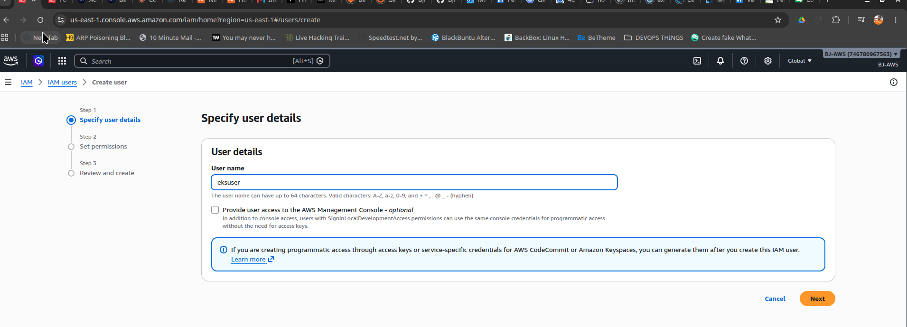

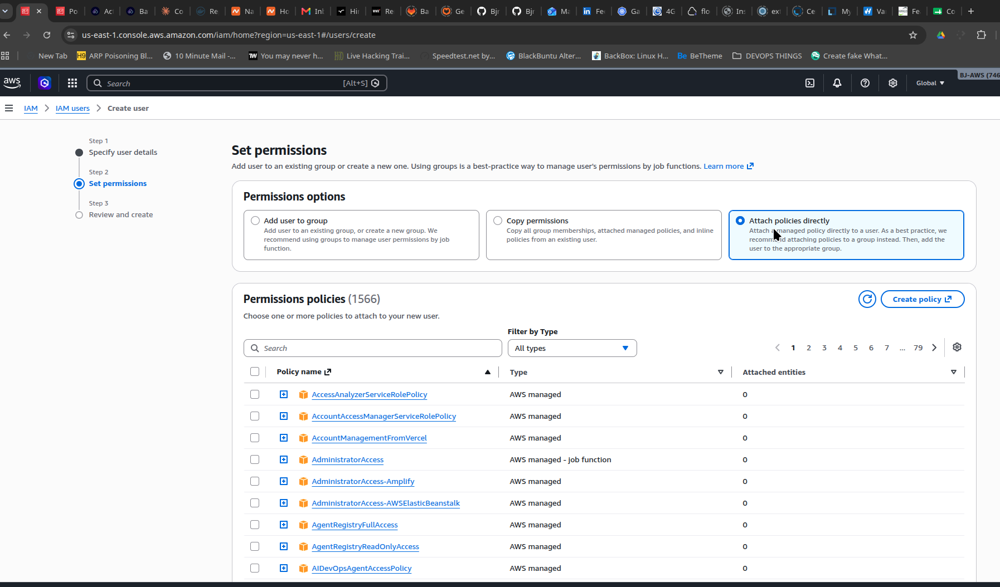

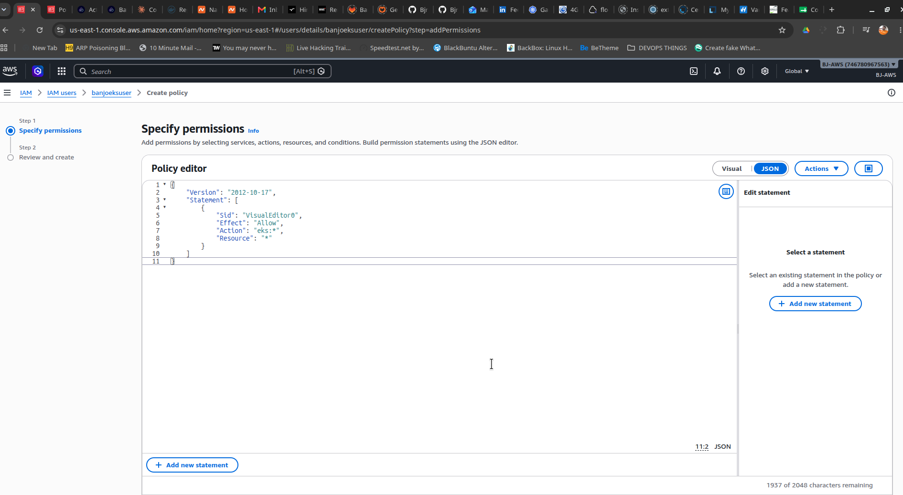

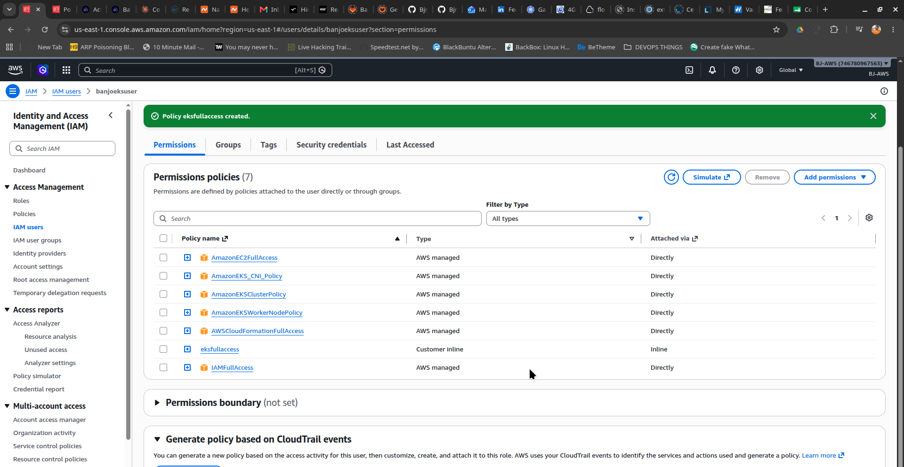

install : awscli , kubectl , and eksctl .

**create EKS Cluster but this time, with eksctl(cloudformation)**

Created `babade-cluster`  using eksctl(cloudformation)

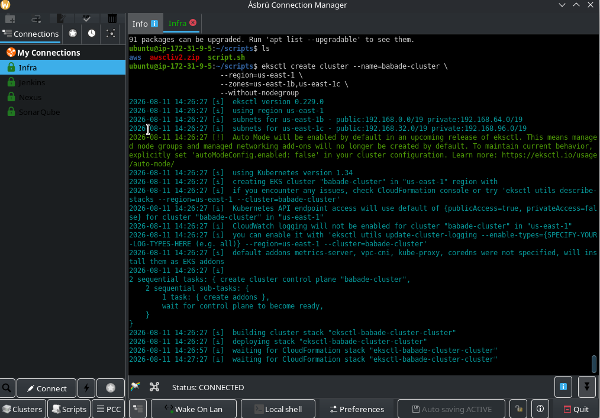

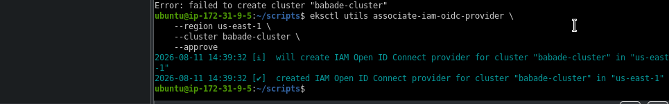

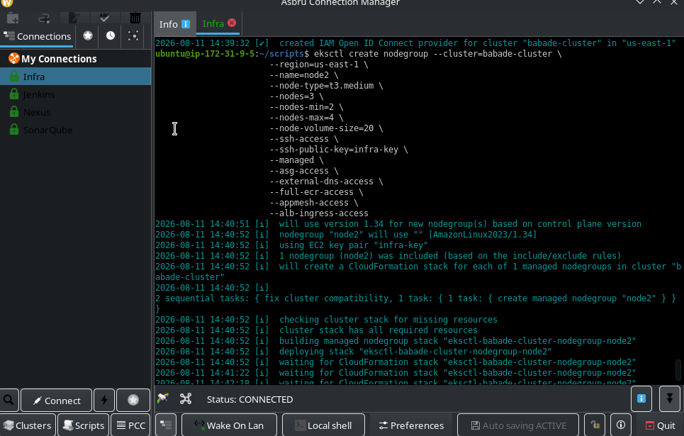

install jenkins and install the following plugins
1. Docker
2. Docker Pipeline
3. pipeline stage view
4. kubernetes
5. kubernetes CLI
6. Multibranch scan webhook Trigger

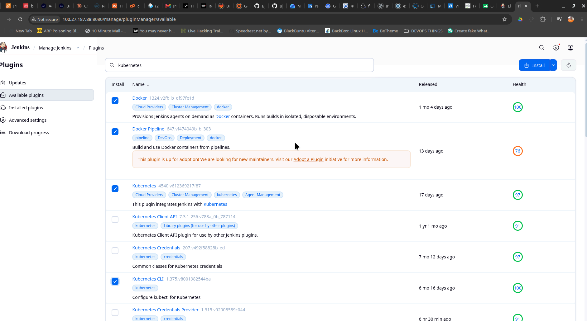

##### create and configure  multibranch webhook trigger
> This will trigger a build should any change be made in any branch of the repo

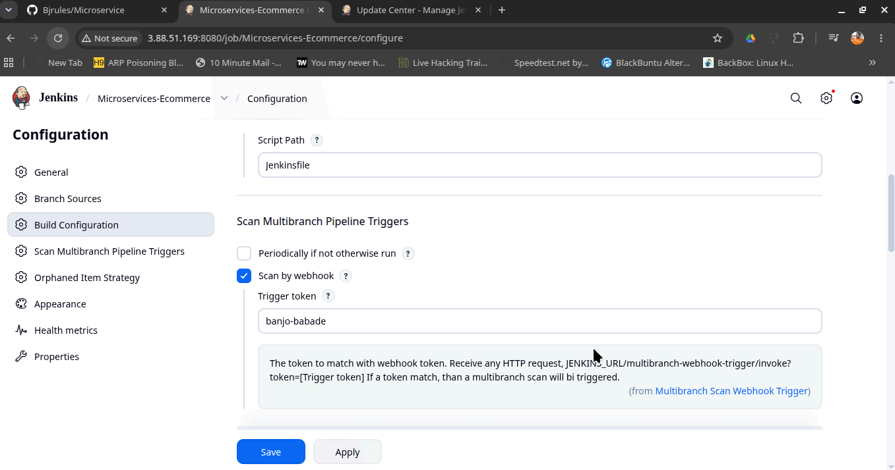

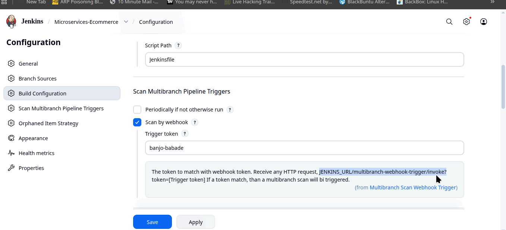

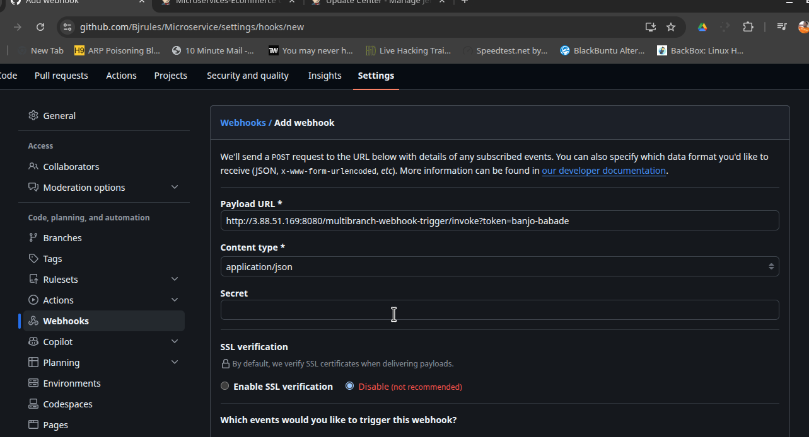

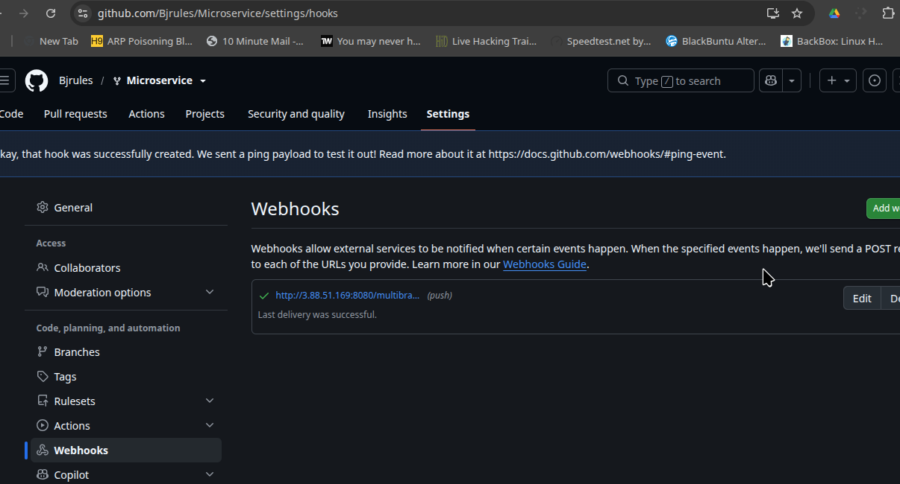

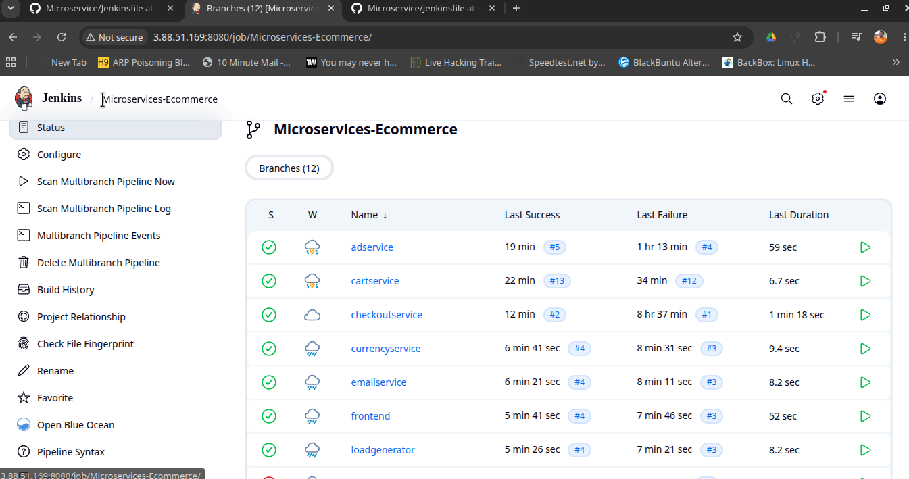

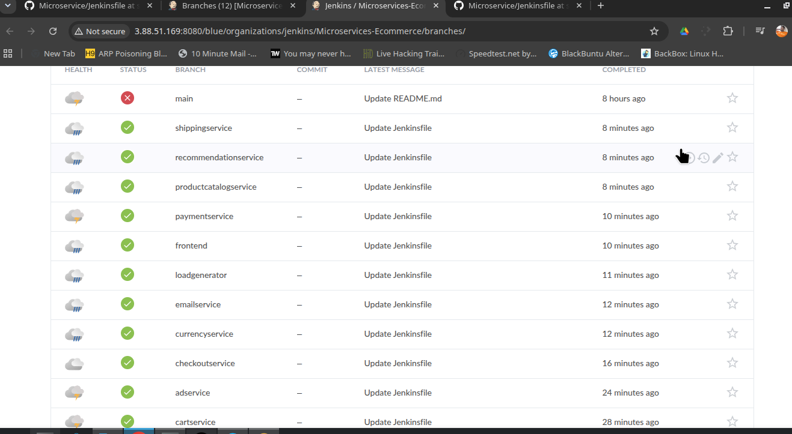

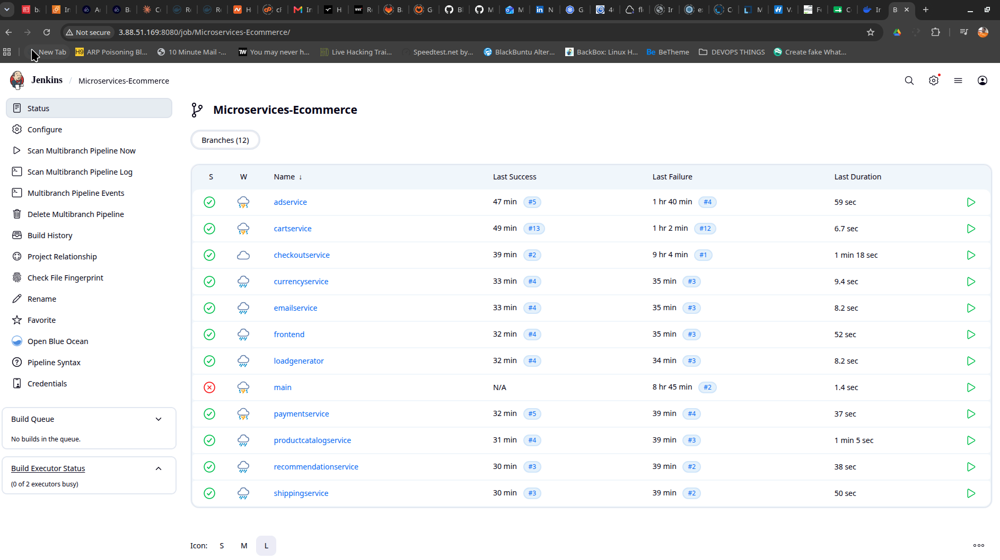

**Setup RBAC**        Also remember to do: `sudo chmod 666 /var/run/docker.sock` so as to enble users to use docker

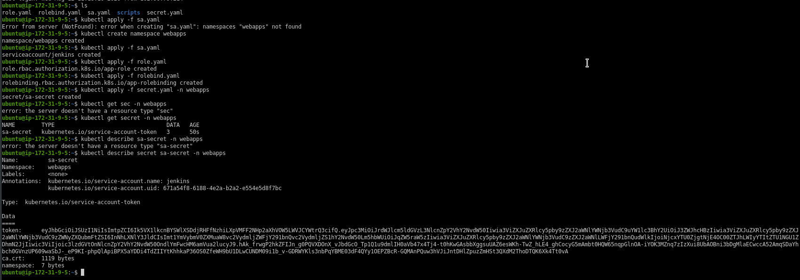

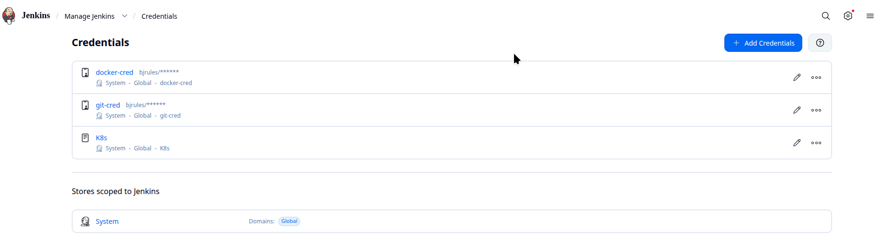

>sucessful Deployment

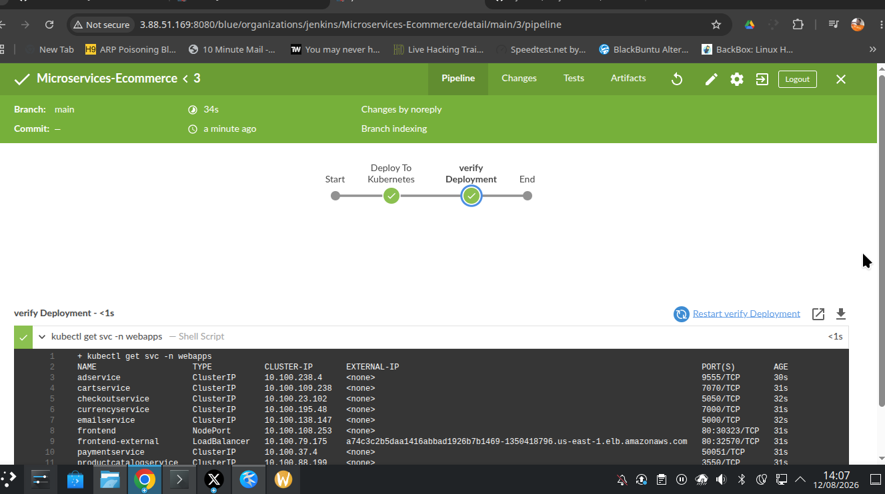

use this command to destroy the cluster `eksctl delete cluster --name babade-cluster --region us-east-1`

    
# Thank you

